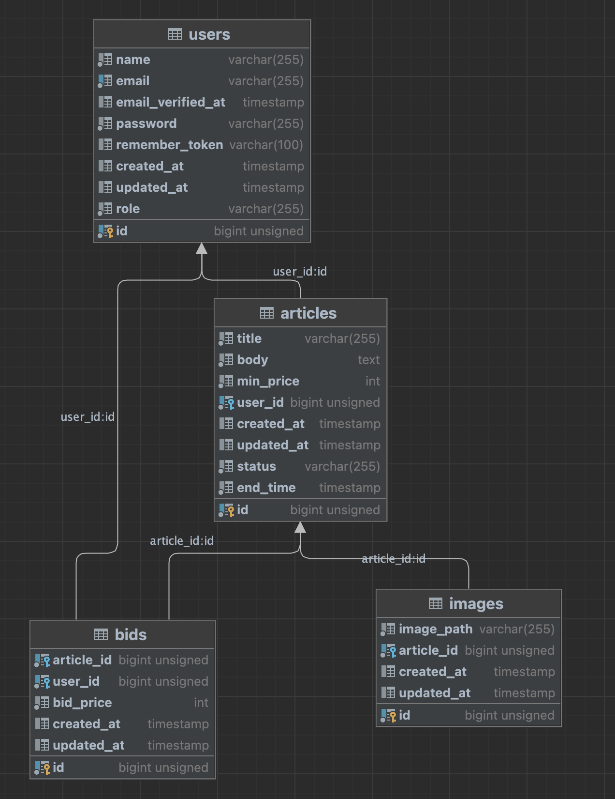

<p align="center"><a href="https://laravel.com" target="_blank"></a></p>

## Database Structure

The app database is structured in these tables:

- users (contains registered users to the app)
- articles (contains of articles)
- images (contains uploaded images and their path)
- bids (contains the bids in a specific article)



## how to run in local

Using docker we could use the tool Sail to setup the project locally

```shell
    # install sail
    composer require laravel/sail
    
    # install dependencies
    ./vendor/bin/sail up -d
```

## Run the app on the browser

- Website:
[http://localhost/](http://localhost/)
- Backoffice
[http://localhost/admin](http://localhost/admin)

**PS:** To connect using in backoffice you need admin credentials

Use this command to generate a new admin user

```shell
  # example
  php artisan users:create --name=admin --email=admin@gmail.com --password=123456
```

## Scheduler

We are using the scheduler to check every minute if there is an article that has status live and the end time has arrived, so we send a notification via email to the seller and the buyer.

For that we should run this command

```shell
  # example
  php artisan schedule:run
```

